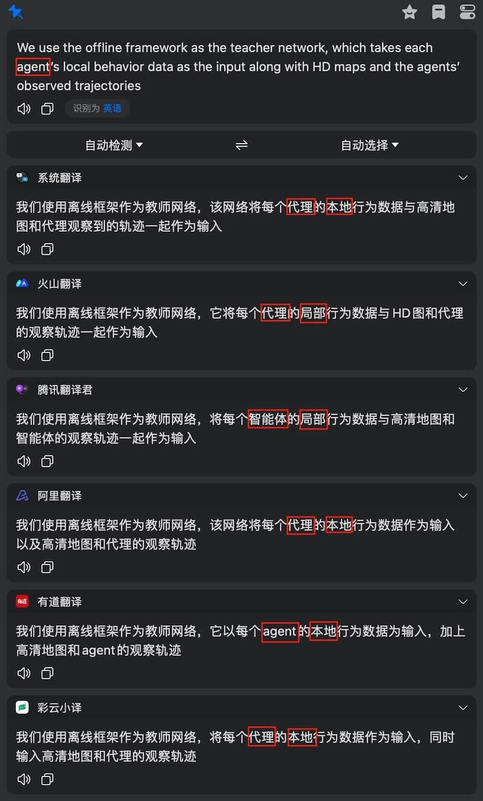

# DLTerms4Chinese

一些单词、短语在专业场景和生活场景中有不同的含义，而翻译工具往往只给出生活场景的翻译。比如在下图的示例中，6个翻译工具里有5个把`agent`翻译成`代理`，但更恰当的翻译应该是`智能体`（只有腾讯翻译的精确妥帖）。

现在，越来越多的翻译工具支持添加术语库，比如[deepL](https://www.deepl.com)、[有道词典9](https://cidian.youdao.com/index-mac.html)、[火山引擎翻译](https://console.volcengine.com/home)、[百度翻译](http://fanyi-api.baidu.com)等。引入术语库有助于改善翻译结果，以百度翻译为例，还是上图的英语内容，添加术语库之前：

添加术语库之后：

两处词语均被正确翻译。

因此，本仓库专门收集`深度学习`术语中**往往被翻译软件翻译错误**的术语（能被正确翻译和不常用的术语不收录其中），保存在`./terms.tsv`中。

# 欢迎纠错和提交术语~

# 参考链接

1. [谷歌开发者文档：机器学习术语表](https://developers.google.cn/machine-learning/glossary?hl=zh-cn)
2. [CS231n计算机视觉术语表](https://cloud.tencent.com/developer/news/105798)
3. [机器之心机器学习中英术语表](https://github.com/jiqizhixin/Artificial-Intelligence-Terminology-Database)

# TODOs 
- [ ] 目前的翻译软件只支持一对一的术语库，但词语之间的翻译其实是一对多或多对多的关系，比如multimodal在不同语境下有多模态、多峰等不同的含义；anchor可根据具体情况翻译成锚点或锚框；bias在描述神经网络层级单元时可以译为偏置，而在描述训练误差和与叉验证误差间的关系或学习曲线时，bias可以译为偏差； Stationary在马尔可夫模型中可译为稳态分布（Stationary distribution），在最优化问题中可译为驻点（Stationary point），而在涉及博弈论或对抗性训练时，其又可能表达为静态。

- [ ] 不同服务商的术语库要求的文件格式和分隔符不同，注意替换。  

